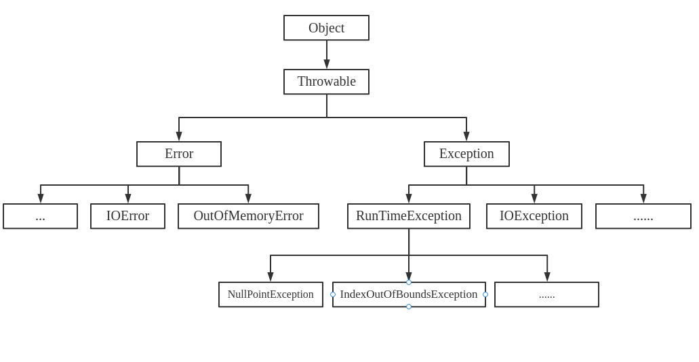

# Java异常

> 异常就是程序运行中发生的错误。任何程序都有可能产生大量未知问题以及错误，如果不对这些问题加以处理，则可能会导致程序的中断、造成不必要的损失。

## Java异常



从以上继承关系看，`Throwable`是所有异常的父类，集成自`Object`。`Throwable`又有两个体系，`Error`表示系统以及硬件方面的错误，无法彻底处理，只能尽量去避免。`Exception`是通过代码可以捕获处理的异常。`Exception`中的异常又会有两种不同处理方式，一种是程序逻辑处理的一部分，应该对其捕获并处理，另外一种是程序编写造成的，这部分问题应该修复程序本身。

Java中规定：

- `Exception`及其子类，但不包括`RuntimeException`必须被捕获。这种类型称为`Checked Exception`，如果对该种异常不进行捕获，程序则会编译失败;
- `Error`以及其子类，`RuntimeException`以及其子类不需要捕获。


## 捕获异常

### 异常的处理方式

1. 显示堆栈跟踪信息

   `e.printStackTrace()`

2. 显示错误详细信息

   `e.getMessage()`

3. 自定义处理规则

### `try...catch`

Java中所有可能抛出异常的语句都可以通t过`try...catch`来捕获。

```java
try {
	// 可能发生异常的代码
} catch (Exception1 e) {
	// 如果发生异常执行的逻辑
} catch (Exception2 e) {
    // 发生异常执行的逻辑
}
```

如果需要捕获多个异常则会有多个`catch`，多个一场按照从上到下的顺序一一进行匹配，如果匹配到发生的异常则执行对应`catch`中的逻辑，然后程序退出不会再向下执行。所以在多个`catch`的时候请注意一定要子类在上，父类在下。如果多种异常发生是执行逻辑相同，则可以用`|`来合并：

```java
try {
    // 可能发生异常的代码
} catch (Exception1 | Exception2 e) {
    // 发生异常执行的逻辑代码
}`
```


### `finally`语句

```java
try {
	// 可能发生异常的代码
} catch (Exception e) {
	// 发生异常的时候执行的逻辑
} finally {
	// 不管是否异常都会执行
}
```

`finally`用来保证一些代码必须执行，如果没有发生异常，则在执行完`try`的代码之后执行`finally`中的代码，如果发生异常则在执行完`catch`之后执行`finally`。通常`finally`中用来释放资源。

### `try-with-resource`

`try-with-resource`常用来在请求资源的代码逻辑执行完之后自动释放资源。在`JDK1.7`之前使用资源需要明确的关闭：

```java
InputStream is = null;
try {
    is = new FileInputStream("xxx.txt");
    // xxxxx
} catch (IOException e) {
    // xxx
} finally {
    if (null != is) {
        try {
            is.close();
        } catch (IOException e) {
            e.printStackTrace();
        }
    }
}
```

使用`try-with-resource`之后：

```java
try (InputStream is = new FileInputStream("xxx.txt")) {
    // xxx 
} catch (IOException e) {
    // xxx
}
```

`try-with-resource`可以使用的资源是实现了`java.lang.AutoCloseable`接口的类，可以通过自定义实现`AutoCloseable`的类使用。

## 抛出异常

### 异常的传播

如果某个方法抛出异常，当前调用该方法的方法没有捕获异常，异常就会被抛到上层调用方法，直到遇到某个`try-catch`为止。

Java中异常的传递是默认按照调用链反向传递，如果一直都没有处理，最终由JVM进行默认处理，打印异常的堆栈信息。

```java
public void catchException() {
    try {
        getExceptionWithCatch();
    } catch (Exception e) {
        e.printStackTrace();
    }
    // java.lang.NullPointerException
	//	at com.masq.basic.exception.App.throwException(App.java:32)
	//	at com.masq.basic.exception.App.getExceptionWithCatch(App.java:28)
	//	at com.masq.basic.exception.App.catchException(App.java:21)
}


public void getExceptionWithCatch() {
    throwException();
}

public void throwException() {
    throw new NullPointerException();
}
```

### 抛出异常

抛出异常可以通过`throw`关键字抛出异常：

1. 创建想要抛出的异常实例；
2. 通过`throw`将该实例抛出。

可以在一个方法中`try...catch`捕获到异常之后抛出另外一个异常，这样相当于类型转换：

```java
public void conversionException() {
    try {
        getExceptionWithCatch();
    } catch (Exception e) {
        //  throw new IllegalArgumentException();    // 抛出新的异常，打印的堆栈信息中不存在原来的异常信息
        throw new IllegalArgumentException(e);       // 抛出新的一场，堆栈信息中有原来的异常信息
    }
}
```

### 异常屏蔽

```java
try {
    System.out.println(1/0);
} catch (Exception e) {
    System.out.println("catch");
    throw new IllegalArgumentException();
} finally {
    System.out.println("finally");
    throw new NullPointerException();
}
// catch
// finally
// Exception in thread "main" java.lang.NullPointerException
// 	at com.masq.basic.exception.App.exceptionShielding(App.java:38)
// 	at com.masq.basic.exception.App.main(App.java:27)
```

上面的代码示例可以得知，当`finally`中抛出异常的时候，`catch`中的异常就被屏蔽了，因为只能抛出一个异常。

如果需要获取所有的异常信息，可以通过下面方法：

```java
Exception origin = null;
try {
    System.out.println(1/0);
} catch (Exception e) {
    System.out.println("catch");
    origin = e;
} finally {
    System.out.println("finally");
    NullPointerException exception = new NullPointerException();
    if (null != origin) {
        origin.addSuppressed(exception);
    }
    throw origin;
}
// Exception in thread "main" java.lang.ArithmeticException: / by zero
//	at com.masq.basic.exception.App.getAllException(App.java:34)
//	at com.masq.basic.exception.App.main(App.java:28)
//	Suppressed: java.lang.NullPointerException
//		at com.masq.basic.exception.App.getAllException(App.java:40)
//		... 1 more
```

上面代码输出`catch`中的异常信息，同时在后面`Suppressed`中输出了`finally`中的异常信息。其方法是先用`origin`保存原始异常，然后调用`Throwable.addSuppressed()`把后面的异常添加进来。

