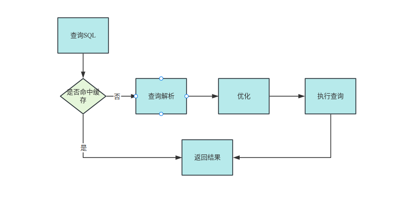

# MySQL性能调优和架构设计

## 范式化设计
- 第一范式(`1NF`)：所有属性不可再分
- 第二范式(`2NF`)：实体属性完全依赖于主键
- 第三范式(`3NF`)：一个数据库不能包含其他数据库中的非主键关键字，即每个属性跟主键偶直接关系而不是间接关系。
- 巴斯-科德范式(`BCNF`)：
- 第四范式(`4NF`)
- 第五范式(`5NF`，又称完美范式)

## 反范式化设计
- 为了保证性能以及查询效率适当的违反对数据库设计范式的要求。
- 为了查询性能，允许存在适当的冗余部分。

## 字段数据类型优化
1. 更小的通常更好
2. 简单就好
3. 尽量避免使用`null`：`null`值占用更多空间，且索引统计更加复杂。

## 命名规范
- 可读性原则
- 使用小写字母或者数字
- 不适用复数英语单词
- 禁用保留字
- 索引命名：主键`pk_xxx`, 唯一键`uk_xxx`, 普通索引`idx_xxx`

## MySQL索引
> 帮助数据库高效获取数据的数据结构。`InnoDB`存储引擎支持以下几种常见索引：B+索引，全文索引，哈希索引(内部)。

> B树跟B+树的区别:    
> 1. B数非叶子节点也会存储数据，而B+树只在叶子节点存储数据。  
> 2. B+树叶子节点之间会有指针的指向。       
> `MySQL`中选用B+树而不是B树的原因：      
> - B树每个节点都存储数据，每次查询的大小固定，就会造成每次查询返回的数据条数变少，相同数据规模下情况下B树会增加IO次数，而B+树则数据量较小，一次可以返回多条记录，IO次数少。
> - 范围查询B+树明显优于B树。

### B+索引

#### 聚簇索引/聚集索引
将表的主键用来构建一个B+树，并且将整张表的行记录保存在叶子节点中。

#### 二级索引/辅助索引
- 二级索引叶子节点除了保存键值之外还会保存一个书签(主键)，不包含所有数据。    
- 二级索引不保存所有数据的原因：每个二级索引都保存全部数据会导致占用空间过大，且每次修改数据都要修改对应二级索引中的数据，影响效率。    

#### 回表
- 通过二级索引获取主键，然后通过主键来找到完整的行记录。       
- 回表次数过多会影响SQL查询效率，实际操作过程中应该尽量避免回表。     

#### 联合索引/复合索引
- 表中多个列组合起来创建索引。多个列优先左边开始排列。   
- 最佳左前缀。    
- 为了避免索引过多，可以通过联合索引来较少索引数量。       

#### 覆盖索引    
通过二级索引可以查询到的数据可以不用通过回表再次查询聚簇索引。    

### 哈希索引

- **自适应哈希索引：**B+树的高度一般是1-3层，所以一般查询需要1-3次IO。如果有一些热数据，每次都需要3次IO会导致效率低下，所以此时MySQL内部会采用哈希索引。 
- 哈希索引在5.7中默认开启，`innodb_adaptive_hash_index`来考虑是启用或是禁用此特性。 


```sql
> show engine innodb status;  # 查看状态
# Status列中下面这段是innodb中哈希索引相关的信息
...
-------------------------------------
INSERT BUFFER AND ADAPTIVE HASH INDEX
-------------------------------------
Ibuf: size 1, free list len 0, seg size 2, 0 merges
merged operations:
 insert 0, delete mark 0, delete 0
discarded operations:
 insert 0, delete mark 0, delete 0
Hash table size 34679, node heap has 3 buffer(s)
Hash table size 34679, node heap has 2 buffer(s)
Hash table size 34679, node heap has 6 buffer(s)
Hash table size 34679, node heap has 1 buffer(s)
Hash table size 34679, node heap has 9 buffer(s)
Hash table size 34679, node heap has 2 buffer(s)
Hash table size 34679, node heap has 2 buffer(s)
Hash table size 34679, node heap has 4 buffer(s)
0.00 hash searches/s, 0.00 non-hash searches/s
...
```

## 高性能索引创建策略

### 索引在查询中的作用

1. 一个索引就是一个B+树，索引让我们的查询可以快速定位和扫描到我们的 数据记录上面，加快查询的速度。 
2. 一个SELECT语句在执行过程中最多只能使用一个二级索引，即使WHERE条件中用了多个二级索引。 

### 创建策略

1. 索引列尽量小

2. 索引的选择性/离散性：不重复的索引值和数据表记录总数比值越高查询效率越高，即重复数据越少查询效率越高。 

   > 如果整个数据表中数据有10000条，索引列重复的记录只有十条，那么相当于只需要在这10条中查询，重复的越多那么需要过滤的数据越多。   
   >
   > `SELECT COUNT(DISTINCT key)/COUNT(*) FROM tableName`，返回的结果越大说明重复记录越少。  

3. 前缀索引：很长的`VARCHAR`类型数据需要进行前缀索引。`ALTER TABLE tableName add key/index (column(x))`，其中x表示索引取前几个字符。

   > 前缀索引无法引用于`ORDER BY`以及`GROUP BY`，也无法做覆盖索引。因为包含的数据本来就不全。
   >
   > 判断前缀索引的截取长度的时候需要考虑离散型：`SELECT COUNT(DISTINCT LEFT(column, x))/COUNT(*) from tableName`，其中x表示需要截取的长度，返回值越大表示离散度越高。 

4. 后缀索引：MySQL不支持后缀索引。可以用于邮箱等数据。  

5. 联合索引：多列联合建立索引。建立索引只为搜索、排序或分组的列创建索引。 

   1. 选择性最高的列放在最前面。  
   2. 根据运行频次最高的列调整顺序。
   3. 优化性能时可以创建相同列但不同顺序的索引以满足不同的查询情况。 

### 三星索引

> 对于一个查询来说，三星索引可能是其最好的索引。

1. 索引将相关的记录放在一起则获得一星，尽量保证查询的数据连续且范围尽量窄，优先级第二；
2. 索引中的数据顺序跟查询排序一致（排序星），避免数据查出之后再次排序，优先级最低；
3. 索引中的列包含查询所需的所有的列则获得三星（宽索引性），避免回表，优先级最高。


## `MySQL`调优

### `MySQL`调优金字塔


### 查询优化（慢查询）

> 核心原因：数据量较大  

- 查询了不需要的数据：

  - 查询不需要的记录；

    ```sql
    select tb_a, tb_b, tb_c from tableName limit 100000, 20; 
    ```

    

  - 避免查询全部列；

    ```sql
    select * from tableName; 
    ```

    

  - 重复查询相同的数据。  

- 是否存在扫描了额外的数据：
  - 响应时间：服务时间 + 排队时间
  - 扫描的行数和返回的行数
  - 扫描的行数和访问类型 

- 优化思路
  1. 使用覆盖索引
  2. 数据表结构，例如：大量的汇总统计、报表等使用汇总表
  3. 重写复杂的查询`SQL`

### 慢查询

> 查询时间超过`long_query_time`的参数设置的阈值的查询语句

慢查询相关的几个数据库参数：

| 变量名                          | 值                                    | 说明                                                         |
| ------------------------------- | ------------------------------------- | ------------------------------------------------------------ |
| `slow_query_log`                | OFF(关闭，默认)/ON(开启)              | 是否开启慢查询日志，`set global slow_query_log=1`开启慢查询  |
| `slow_query_log_file`           | `/var/lib/mysql/masq-ubuntu-slow.log` | 慢查询日志存放位置，`set global slow_query_log_file='PATH'设置存放位置` |
| `long_query_time`               | 10.000000                             | 表示慢查询的阈值，默认是10秒，`set global long_query_time=1;`设置为1秒 |
| `log_queries_not_using_indexes` | OFF(关闭，默认)/ON(开启)              | 未使用索引的查询也保存到慢查询日志中                         |

#### 慢查询的影响

1. 接口请求时间过长；
2. 占用`MySQL`内存，影响性能；
3. `DDL`操作阻塞。

#### 慢查询场景

1. 没索引、没利用好索引

2. 单表数据量过大

3. Limit深分页

   > 例如：`select * from t_demo where type = 2 order by id limit 100000, 10`，可以先查出主键，避免回表，然后根据主键查出所有字段，语句如下：`select * from t_demo t1, (select id from t_demo where type = 2 order by id limit 100000, 10) t2 where t1.id = t2.id `

4. 使用`FileSort`查询

   > 查询排序内容不能由索引直接完成，`MySQL`可能会进行`FileSort`，数据较少没有超过系统变量`sort_buffer_size`设定大小，直接在内存中进行排序，如果超过该变量大小，则会利用文件进行排序。

#### 慢查询日志

- 日志分析工具`mysqldumpslow`

  - -s 表示按照何种方式排序：
    - c：访问次数
    - l：锁定时间
    - r：返回记录
    - t：查询时间
    - al：平均锁定时间
    - ar：平均返回次数
    - at：平均查询时间
  - -t 表示返回前面几条数据
  - -g 后边可以写一个正则匹配模式，大小写不敏感的

  建议使用的时候配合`more`使用，例如：

  `mysqldumpslow -s r -t 20 /PATH/mysql-slow.log | more`


 ### 执行计划

> `SQL`语句前面加上`EXPLAIN`关键字就行。执行计划中的每一行记录就代表着`MYSQL`对某张表的执行查询时的访问方法/访问类型。可以通过执行计划的信息判断`SQL`的执行情况，以此作为优化依据。

#### 执行计划查询表中的字段

1. `ID`：一条语句对应一个`ID`，有时候`MySQL`优化器会优化`SQL`语句，所以会出现`ID`相同。 

2. `TABLE`：当前语句查询的表

3. `SELECT_TYPE`：

   - `SIMPLE`：简单查询
   - `PRIMARY`：主要查询
   - `UNION`：联合查询
   - `SUBQUERY`：子查询
   - `DEPENDENT SUBQUERY`：主查询依赖的子查询
   - `DEPENDENT UNION`：主查询依赖的联合查询

4. `PARTITIONS`：和分区表有关，一般情况下为NULL

5. `TYPE`：表明访问方法/访问类型是个什么东西，从好到坏排序依次为：

   > `system` > `const` > `eq_ref` > `ref` > `full_text` > `ref_or_null` > `index_merge` > `unique_subquery` >  `index_subquery` > `range` > `index` > `ALL`，出现比较多的是`system` > `const` > `eq_ref` > `ref` > `range` > `index` > `ALL`，一般来说，type的值从`system`到`all`逐渐变差，即从最优到最差。因此，优化查询性能的目标就是尽量将type值从`all`优化到`ref`、`eq_ref`、`const`等类型。

   - `system`：只有一行数据（例如，对于表中只有一行的查询）。
   - `const`：通过索引或者主键唯一性约束来匹配的查询，只返回一行数据。
   - `eq_ref`：通过唯一索引或者主键等值匹配来访问表中的一行数据。
   - `ref`：通过非唯一索引等值匹配来访问表中的多行数据。
   - `range`：通过索引范围来访问表中的多行数据。
   - `index`：通过索引全表扫描来访问表中的所有行数据。
   - `all`：全表扫描，访问表中的所有行数据。

6. `POSSIBLE_KEYS`：可能使用的索引

7. `KEY`：用到的索引  

8. `KEY_LEN`：索引长度

9. `REF`：查询条件类型

10. `ROWS`：预估可能返回的行数，

11. `FILTERED`：预估过滤行数的比例

12. `EXTRA`：提供了一些额外信息，用于解释查询执行的一些特殊情况或者操作。常见的表示符以及含义：

    - `Using index`：表示查询用到了覆盖索引，即查询的所有列都可以通过索引访问，务虚会表示访问表的数据。
    - `Using where`：表示查询中用到了WHERE字句进行条件过滤。
    - `Using temporary`：表示使用了临时表，通常是用于需要进行排序、分组或者连接操作。
    - `Using filesort`：表示查询需要进行外部排序，通常是由于无法使用索引或者需要按照非索引列进行排序。
    - `Using join buffer`：表示使用了连接缓冲区，用于处理连接操作。
    - `Impossible where`：表示查询的WHERE子句中的条件不可能为真，导致查询不会返回任何结果。
    - `Select tables optimized away`：表示查询中的某些表可以被优化器消除，因为查询的结果可以从其他表中直接获得。


#### 查询优化器

> `MySQL`查询优化器负责分析和优化查询语句，以提高查询的执行性能。



 查询优化器工作过程：

1. 解析查询语句：优化器首先会解析查询语句，理解查询的语义和逻辑。
2. 生成可能得执行计划：优化器会生成多个可能得执行计划，每个执行计划对应一个查询的不同操作顺序和算法。
3. 评估执行计划的成本：优化器会评估每个执行计划的成本，成本通常是根据查询的统计信息和估计的数据访问次数来计算的。
4. 选择最佳的执行计划：优化器会根据成本模型和一些启发式规则，选择最佳的执行计划作为最终的执行方案。

> 优化器的目标实在找到最优的执行计划，以最小的成本获取查询结果。然而，优化器的选择不一定是最优的，因为优化器只是根据统计信息和启发规则来进行评估和选择，在某些情况下，手动优化查询语句或者调整标的索引结构可能会比优化器的选择更好。

优化查询的措施：

1. 编写合适的查询语句，避免不必要的连接、排序和聚合操作。、
2. 创建适当的索引，以加快查询的数据访问。
3. 更新统计信息，已提供准确的查询优化器估计。
4. 调整服务器的配置参数，以适应查询的负载和性能需求。


#### 高性能索引使用策略

1. 不要在索引列上进行任何计算或者使用函数
2. 尽量全值匹配
3. 最佳左前缀法则
4. 范围条件放最后
5. 尽量使用覆盖索引
6. 慎用不等于
7. NULL以及NOT NULL会影响索引使用
8. 查询条件数据类型要统一，如果数据类型不统一可能会使用全表扫描
9. 模糊查询尽量使用`xx%`，匹配字段尽量放在后面
10. 使用or关键字需要注意
11. 