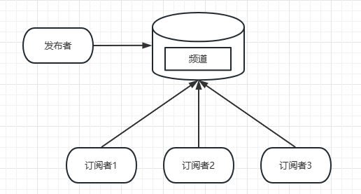

# Redis进阶
## 慢查询分析
> 慢查询日志就是系统在命令执行前后计算每条命令的执行时间，当超过预设阈值，就将这条命令以及其相关信息记录下来。      
> Redis命令的生命周期: 发送命令 --> 命令排队 -->  命令执行 --> 返回结果，慢查询只统计命令执行的时间，所以没有慢查询并不代表客户端没有超时问题。    

###  慢查询配置
1. 慢查询阈值设置   
  `slowlog-log-slower-than`：单位为微秒，默认时间是10000，当命令执行时间超过10000微秒也就是10ms的时候，该命令就会被记录到慢查询日志中。如果设置为0则表示记录所有命令。如果设置<0的不进行记录。   
2. 慢查询日志存放位置   
  `slowlog-max-len`: Redis使用一个列表来记录慢查询日志，该条配置则为列表的最大长度，如果记录超出最大长度，则第一条记录出列，新的一条进入最后一个位置。
    
    > 配置方式： 
    > 1. 修改配置文件中的配置信息
    > 2. 客户端中使用config set命令配置，如果想要持久化到本地配置文件，则需要执行config rewrite命令。   

3.  获取慢查询日志    
  `slowlog get {n}`: 通过n来指定查询的条数 
      ```shell
      127.0.0.1:6379> slowlog get 2
      1) 1) (integer) 12             # 慢日志的标识ID
         2) (integer) 1677002611     # 发生的时间戳
         3) (integer) 14602          # 命令耗时
         4) 1) "slowlog"             # 执行的命令以及参数
            2) "get"
            3) "1"
         5) "127.0.0.1:37924"        # 客户端信息
         6) ""                       
      2) 1) (integer) 11
         2) (integer) 1676858661
         3) (integer) 14612
         4) 1) "ttl"
            2) "age:list"
         5) "192.168.154.1:6627"
         6) "192.168.154.128@6379"
      ```
4. 获取慢查询日志当前的长度    
  `slowlog len`：
5. 慢查询日志重置  
  `slowlog reset`  

### 最佳实践
1. 线上建议调大慢查询记录，因为记录慢查询时Redis会对长命令进行截断操作，并不会占用大量内存。
增大列表可以减缓慢查询被剔除的时间，例如线上可以设置1000以上。
2. slowlog-log-slow-than，在高QPS的情况下，命令执行时间对于系统影响比较大，这种情况下建议设置为1ms.
3. 慢查询只记录命令执行时间，因为命令排队机制，redis可能会导致其他命令级联阻塞，因此当客户端请求超时时，
需要检查该时间点是否有慢查询，从而分析是否因为慢查询导致的阻塞。 
4. 由于慢查询是一个先进先出的队列，所以当慢查询数量多的时候可能会导致部分慢查询命令丢失，可以通过定期持久化到其他存储中来记录。  
同时也可以基于此专门制作可视化界面进行查询，  

## Pipeline
> RTT(Round Trip Time 往返时间)
> 多条命令组合成一个流水线，有效节约RTT
> Redis执行命令时微妙级别，性能瓶颈时网络。

#### 最佳时间
1. 命令个数不能没有节制，否则会增加客户端等待时间，可以将一个很大的pipeline拆分成多个小的pipeline执行。 
2. 只能操作一个Redis，但是即使在分布式事务中也可以作为批量操作的重要优化手段。   

## 事务与Lua
### 事务
> 一组动作，要么全部执行，要么全部不执行。   
> 只用命令错误才会回滚，逻辑错误不支持回滚，只要命令正确都可以正常执行。
> 通过watch来确保事务中的key没有被其他客户端修改。  


### Lua脚本
> C语言开发
> 语法

#### Redis中使用Lua
1. `eval`
   ```shell
   127.0.0.1:6379> eval 脚本内容 key的个数 key列表 参数列表
   127.0.0.1:6379> eval 'return "hello " .. KEYS[1] .. " " .. ARGV[1]' 1 redis world
   "hello redis world"
   ```
   如果Lua脚本比较长，可以在客户端编写好Lua脚本代码，然后使用`redis-cli --eval`将脚本作为字符串发送给服务器，
   服务器会将执行结果返回给客户端。
2. `evalsha`  
   通过`script load`命令将脚本内容加载到Redis内存中，得到SHA1，较少每次将脚本上传到redis的开销，`evalsha`可以使用sha
   作为参数，执行逻辑同`eval`
   ```shell
   127.0.0.1:6379> evalsha sha1 numkeys key [key ...] arg [arg ...]
   ```
3. Lua的Redis API
   Lua可以通过redis.call函数实现对Redis的访问，例如：
   ```shell
   127.0.0.1:6379> eval 'return redis.call("set", KEYS[1], ARGV[1])' 1 hello redis
   OK
   127.0.0.1:6379> eval 'return redis.call("get", KEYS[1])' 1 hello
   "redis"
   ```

#### Lua的优点
1. Lua脚本执行时原子性的，中间不会插入其他语句。 
2. Lua可以帮助开发和运维人员创造自己定制的命令，并且可以保存到redis中，实现复用的效果。
3. 多条命令一次性打包，较少网络开销。

#### Redis管理Lua脚本
1. `script load script`  将脚本加载到Redis内存中
2. `script exists sha [sha ...]`  判断lua脚本是否存在
3. `script flush`  清除内存中所有的脚本
4. `script kill`  杀掉正在执行的lua脚本

## Bitmaps
> 可以将Bitmaps看成一个以位为单位的数组，数组的每个单元只能存储0和1，数组的下标就是Bitmaps的偏移量。    
> 1. Bitmaps本身不是一种数据结构，其本质上就是一个字符串类型的，但是它可以操作字符串的位。  
> 2. Bitmaps提供了一套独立于字符串类型的命令。     

### 常用命令  
```redis
# 指定key的Bitmap设置某个偏移量的位
SETBIT key offset value   
# 获取值
GETBIT key offset
# 获取指定范围内1的个数 
BITCOUNT key [start end]
# Bitmaps之间的运算，其中operation有and(交集)、or(并集)、not(非)以及xor(异或)
BITOP operation destkey key [key ...]
```

### Bitmaps与Set集合
- 1亿用户，每日访问用户5000万的情况下：

| 数据类型 | 用户ID占用空间 |  需要存储的用户量   |           占用总内存           |   
|:----:|:--------:|:-----------:|:-------------------------:|   
| Set  |   64位    |  5000 0000  |  64位 * 5000 0000 = 400MB  |
|Bitmaps|  1位  | 1 0000 0000 | 1位 * 1 0000 0000 = 12.5MB |

- 1亿用户，日活5000万的请开给你下随时间推移的内存对比 ：  

 | 数据类型 |   一天   | 一个月 |  一年  |   
 |:-----:|:---:|:----:|:----:|
 |Set | 400M | 12G | 144G |
 | Bitmaps | 12.5M | 375M | 4.5G |

- 1亿用户，日活只有10万的情况下内存对比： 

| 数据类型 | 用户ID占用空间 |  需要存储的用户量   |           占用总内存           |   
|:----:|:--------:|:-----------:|:-------------------------:|   
| Set  |   64位    |  100 0000   |  64位 * 100 0000 = 800KB   |
|Bitmaps|  1位  | 1 0000 0000 | 1位 * 1 0000 0000 = 12.5MB |

> 很明显在访问量比较多的情况下，Bitmaps更为节省内存，但是如果访问量比较小，那么使用Bitmaps就
> 不是很适合了，因为大多数位存储的都是0.

## HyperLogLog
> HyperLogLog实际类型位字符串  
> 可以利用极小的空间完成独立总数的统计。
> 空间占用小，估算数值不是100%准确，失误率位0.81%。 
> 适合用于统计总数，但不需要获取单条数据，而且需要容忍一定程度的误差。  

### 常用命令 
```redis
# 添加 
PFADD key element [element ...]  
# 统计
PFCOUNT key [key ...] 
# 合并
PFMERGE destkey sourcekey [sourcekey ...]
```

## 发布订阅  
> 消息发布者与订阅者不直接通信，发布者向指定的频道发布消息，订阅该频道的每个客户端都可以收到消息。   
> 客户端执行订阅命令之后进入订阅状态，只能接受`subscribe`、`psubscribe`、`unsubscribe`、 `punsubscribe`四个命令。   
> 新开启订阅的客户端无法收到之前频道的消息，因为Redis不会对发布的消息进行持久化。   




### 常用命令 
```redis
# 发布消息
PUBLISH channel message 
# 订阅消息 
SUBSCRIBE channel [channel ...]   
# 取消订阅 
UNSUBSCRIBE [channel [channel ...]] 
# 按照模式订阅或者取消订阅 
PSUBSCRIBE pattern [pattern ...]
PUNSUBSCRIBE [pattern [pattern ...]]
# 查看活跃的频道 
PUBSUB CHANNELS pattern
# 查看频道订阅数 
PUBSUB NUMSUB channel 
# 查看模式订阅数 
PUBSUB NUMPAT
```

## GEO   
> Redis3.2版本实现了GEO功能，支持存储地理位置信息来实现诸如 附近位置、摇一摇这一类依赖地理位置信息的功能。   
> GEO的数据类型位zset   
> GEO使用geohash将二维经纬度转换为一维字符串，geohash的特点是： 
> 1. 字符串越长，表示的位置越精确。
> 2. 两个字符串越相似，之间的距离越近。
> 3. 经纬度可以相互转换

### 常用命令  
```redis
# 添加地理位置
GEOADD key [NX|XX] [CH] longitude latitude member [longitude latitude member ...]
# 获取地理位置 
GEOPOS key member [member ...]  
# 获取两个位置的距离。 m(米)/km(千米)/ft(尺)/mi(英里)
GEODIST key member1 member2 [m|km|ft|mi]
# 获取指定位置范围内的位置集合，WITHCOORD包含经纬度 WITHDIST包含离中心节点的距离 WITHHASH包含geohash
GEORADIUS key longitude latitude radius m|km|ft|mi [WITHCOORD] [WITHDIST] [WITHHASH] [COUNT count [ANY]] [ASC|DESC] [STORE key] [STOREDIST key]
GEORADIUSBYMEMBER key member radius m|km|ft|mi [WITHCOORD] [WITHDIST] [WITHHASH] [COUNT count [ANY]] [ASC|DESC] [STORE key] [STOREDIST key]
# 获取geohash 
GEOHASH key member [member ...]
# 删除地理信息，因为底层是zset，所以使用zset删除成员的方式删除 
ZREM key mekber [member ...]
```


