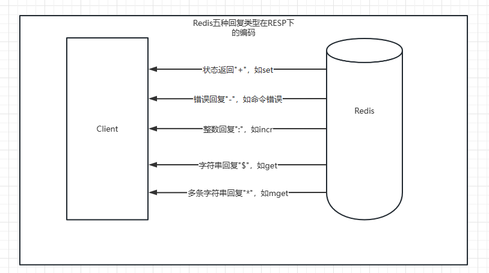

## 一些问题
1. 为什么生产环境不要使用keys来遍历redis中的key?
   > 由于redis是单线程的，当redis中包含大量的键，执行keys的时候可能会导致redis阻塞。如果真的有遍历键的需求，可以考虑下面集中方法 
   > 1. 在一个不对外提供服务的从节点上执行，这样不会阻塞到客户端的请求，但是会影响到主从复制。
   > 2. 如果确定总键数比较少，遍历不需要花费太多时间，可以执行。
   > 3. 使用scan命令渐进式遍历的方式来解决keys可能带来的阻塞。

## Redis基础
1. Redis提供5种数据结构， 每种数据结构都有多种内部编码实现。
2. 纯内存存储、 IO多路复用技术、 单线程架构是造就Redis高性能的三个因素。
3. 由于Redis的单线程架构， 所以需要每个命令能被快速执行完， 否则会存在阻塞Redis的可能， 理解Redis单线程命令处理机制是开发和运维Redis的核心之一。
4. 批量操作（例如mget、 mset、 hmset等） 能够有效提高命令执行的效率， 但要注意每次批量操作的个数和字节数。
5. 了解每个命令的时间复杂度在开发中至关重要， 例如在使用keys、 hgetall、 smembers、 zrange等时间复杂度较高的命令时， 需要考虑数据规模 对于Redis的影响。
6. persist命令可以删除任意类型键的过期时间， 但是set命令也会删除字符串类型键的过期时间， 这在开发时容易被忽视。
7. move、 dump+restore、 migrate是Redis发展过程中三种迁移键的方式， 其中move命令基本废弃， migrate命令用原子性的方式实现了dump+restore， 并且支持批量操作， 是Redis Cluster实现水平扩容的重要工具。
8. scan命令可以解决keys命令可能带来的阻塞问题， 同时Redis还提供170了hscan、 sscan、 zscan渐进式地遍历hash、 set、 zset。

## Redis进阶
1. 慢查询中的两个重要参数slowlog-log-slower-than和slowlog-maxlen。
2. 慢查询不包含命令网络传输和排队时间。
3. 有必要将慢查询定期存放。
4. redis-cli一些重要的选项， 例如--latency、 –-bigkeys、 -i和-r组合。
5. redis-benchmark的使用方法和重要参数。
6. Pipeline可以有效减少RTT次数， 但每次Pipeline的命令数量不能无节制。
7. Redis可以使用Lua脚本创造出原子、 高效、 自定义命令组合。
8. Redis执行Lua脚本有两种方法： eval和evalsha。
9. Bitmaps可以用来做独立用户统计， 有效节省内存。
10. Bitmaps中setbit一个大的偏移量， 由于申请大量内存会导致阻塞。
11. HyperLogLog虽然在统计独立总量时存在一定的误差， 但是节省的内存量十分惊人。
12. Redis的发布订阅机制相比许多专业的消息队列系统功能较弱， 不具备堆积和回溯消息的能力， 但胜在足够简单。
13. Redis3.2提供了GEO功能， 用来实现基于地理位置信息的应用， 但底层实现是zset。

## 客户端通信协议(RESP)
- 参数格式    
  `set hello world`经客户端封装之后:

  ```
  *3       三个参数数量  
  SET    
  $5       key的字符数    
  hello    
  $5       value的字符数   
  world   
  ```      
  最终传输格式：  
  `*3\r\nSET\r\n$5\r\nhello\r\n$5\r\nworld\r\n`  
  返回结果： +OK

- 返回结果格式 

  - 状态回复：第一个字符"+"
  - 错误回复：第一个字符"-"
  - 整数回复：第一个字符":"
  - 字符串回复：第一个字符"$"
  - 多条字符串回复：第一个字符"*"

  


