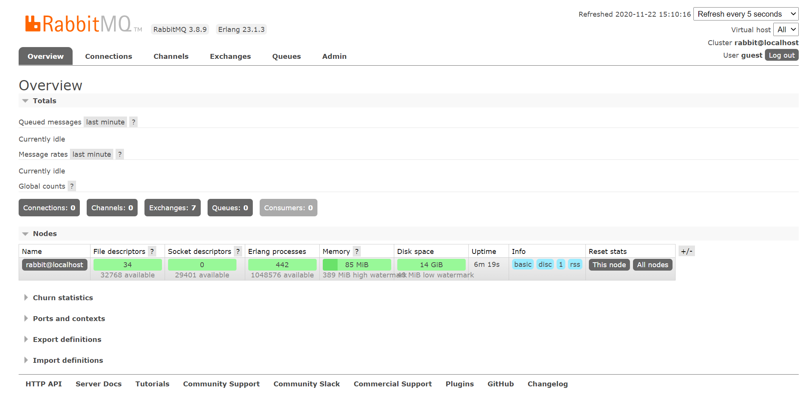

# 消息队列之RabbitMQ

## 1. MQ(Message Queue) 

### 1.1 什么是MQ？

消息队列, 别名消息中间件

生产者、消费者

- 异步通信
- 应用解耦
- 流量削峰
- 消息通讯

### 1.2 有哪些MQ？不同MQ的优劣

- `ActiveMQ`：比较老，性能较差。
- `RocketMQ`：吸收`Kafka`优点，改进缺点，部分功能收费。
- `RabbitMQ`：性能好，可靠性高，完全开源。
- `Kafka`：性能好，但是可靠性低，常用于日志收集。
- ......

## 2. `RabbitMQ`

基于AMPQ协议，`Erlang`语言开发。

- AMPQ：Advanced Message Queuing Protocol（高级消息队列协议），不受客户端/中间件限制，不受开发语言限制。


- `RabbitMQ`四个组件
  - 生产者：发送消息
  - 交换器：传递消息到队列
  - 队列：存储消息
  - 消费者：处理消息

### 2.1 `RabbitMQ`安装

1. 查看对照表Erlang跟RabbitMQ版本对照

   

   2. 下载rpm包

   3. 通过`yum install -y rpm包`安装

      1. 安装Erlang
      2. 安装RabbitMQ

   4. 启动RabbitMQ

      ```shell
      # 启动RabbitMQ
      systemctl start rabbitmq-server.service
      # 查看RabbitMQ状态
      systemctl status rabbltmq-server.service
      # 停止
      systemctl stop rabbitmq-server.service
      # 重启
      systemctl restart rabbitmq-server.service
      ```

      

   5. 安装可视化插件

      ```shell
      rabbitmq-plugins enable rabbitmq_management
      ```

      安装完成之后可以通过`ip:15672`访问，默认账号密码都是`guest`

      此时在本机已经可以访问管理系统了，但是无法正常远程访问。登陆的时候会提示`User can only log in via localhost`

      如果想要远程登录管理系统需要增加配置

      ```shell
      # 新建rabbitmq.config文件
      vim /etc/rabbitmq/rabbitmq.config
      # 写入如下配置
      [{rabbit, [{loopback_users, []}]}]
      ```

      或者是按照官网：

      ```shell
      # 新建rabbitmq.conf文件
      vim /etc/rabbitmq/rabbitmq.conf
      # 添加一行简单的配置
      # DANGER ZONE!
      #
      # allowing remote connections for default user is highly discouraged
      # as it dramatically decreases the security of the system. Delete the user
      # instead and create a new one with generated secure credentials.
      loopback_users = none
      ```
      增加以上之后就可以成功进入rabbitmq管理后台
      

### 2.2 `RabbitMQ`配置


##  3. Java Example

### `Hello World`

*完整代码：rabbitmq-example/rabbitmq-base/src/main/java/com/kangfawei/hello_world包下*

1. 与服务器建立一个连接

   ```java
   ConnectionFactory factory = new ConnectionFactory();
   factory.setHost(ip); // 设置主机，默认localhost
   factory.setPort(port);  // 设置端口,默认情况下为-1，在连接的时候根据ssl判断是5671还是5672
   factory.setUsername(username); // 设置用户名，默认guest
   factory.setPassword(password); // 设置连接密码，默认guest
   factory.setVirtualHost(virtualHost); // 设置虚拟主机， 默认“/”
   factory.setUri(URI);  factory.setUri(uriString);  // 根据uri连接
   
   // try-with-resource，不用再finally中写关闭连接的代码，在代码块执行完成之后自动关闭
   try(Connection connection = factory.newConnection();
      Channel channel = connection.createChannel()) {}
   ```

   *注意：在接收消息的时候因为我们需要跟服务器一直保持连接等待消息，所以不需要通过try-with-resource的方式关闭连接。*

2. 消息发送

   消息发送分为两步：

   1. 声明一个我们消息需要发送到的队列

      ```java
      /**
        * @param queue 队列名称
        * @param durable 如果设置为true则该队列为一个持久的队列，rabbitmq重启的时候依然存在
        * @param exclusive 如果为ture则说明该队列为独占的。仅限于本次连接
        * @param autoDelete 设置为true表示该队列不再使用的时候可以自动删除
        * @param arguments 队列的其他参数
        */
      Queue.DeclareOk queueDeclare(String queue, boolean durable, boolean exclusive, boolean autoDelete,
                                       Map<String, Object> arguments) throws IOException;
      
      ```

      

   2. 发送消息到队列中

      ```java
      /** 
        * @param exchange 消息发送到的交换器
        * @param routingKey 路由键
        * @param props 消息的其他参数
        * @param body 消息内容
        */
      void basicPublish(String exchange, String routingKey, BasicProperties props, byte[] body) throws IOException;
      ```

      

   *注意：发送消息必须在try-with-resource代码块中*

3. 通知服务器传递消息

   ```java
   DeliverCallback deliverCallback = new DeliverCallback() {
       @Override
       public void handle(String consumerTag, Delivery message) throws IOException {
           // TODO 处理消息
           
           channel.basicAck(delivery.getEnvelope().getDeliveryTag(), false);
       }
   }
   ```

   

### `Work Queue`

*完整代码：rabbitmq-example/rabbitmq-base/src/main/java/com/kangfawei/work_queue包*

1. `RabbitMQ`消息确认  

   `RabbitMQ`会在收到确认消息之后删除队列中的消。如果消息处理很复杂，需要消耗很长时间，自动确认的情况下，一旦在数据处理中途消费者停止，会发生数据丢失的现象。手动确认可以在数据处理完之后发送一条确认消息，这时候队列再去删除消息就不会丢失数据， 在消费者停止之后，所有未确认的消息会重新发送

   ```java
   boolean autoAck = false;  // true 自动确认  false 手动确认
   channel.basicConsume(TASK_QUEUE_NAME, autoAck, deliverCallback, consumerTag -> { });
   ```

2. 消息持久性

   如果不做任何设置，`RabbitMQ`停止或者崩溃的时候会丢失所有的队列。所以，我们需要把队列跟消息标记为持久的，这时候当`RabbitMQ`重启的时候队列依然存在。

   ```java
   // 设置队列持久性
   boolean durable = true; // ture表示持久保存
   channel.queueDeclare(QUEUE_NAME, durable, false, false, null);
   ```

   *注意：已经存在的队列不可以重新设置不同的参数，否则会返回一个错误。该设置需要同时在生产者与消费者中设置。*

   之后我们还需要将消息设置为持久性的。可以如下将`basicPublish`的props参数设置为`MessageProperties.PPERSISTENT_TEXT_PLAIN`

   ```java
   channel.basicPublish("", QUEUE_NAME, MessageProperties.PERSISTENT_TEXT_PLAIN, message.getBytes());
   ```

3. 公平派遣

   在不做特定配置的情况下，`RabbitMQ`分配任务默认是以轮询的方式分配的。如果两个消费者中有一个一直处理一些复杂的任务，而另外一个的任务则很简单，很快就可以完成。这种情况下就需要做一些配置，保证一个消费者需要同时处理多个任务。

   ```java
   int prefetchCount = 1;
   channel.basicQos(prefetchCount);
   ```

   以上配置保证一个消费者在没有确认上一条消息的前不会被分配到另外一条消息。

### `publish/Subscribe`

*完整代码：rabbitmq-example/rabbitmq-base/src/main/java/com/kangfawei/publish_subscribe包*

1. 发布/订阅模式

   `RabbitMQ`的核心是生产者不会直接发送消息到队列，甚至很多时候生产者并不知道消息是否已经被发送到队列中。

   **交换器：**交换器相当于生产者与消息队列中间的一个中转站，消息通过交换器进入队列。交换器类型可以决定生产者生产的消息是要发给一个队列或是发送给多个队列，或者是需要销毁。

   > **交换器的类型：**
   >
   > 1. `direct`(默认)：根据消息携带的路由键(routing key)将消息投递给对应队列。
   > 2. `fanout`：`fanout`是一种发布/订阅模式的交换器，当发送一条消息的时候，交换器会把消息广播到所有附加到这个交换器的队列上。
   > 3. `topic`：匹配订阅模式。适合用路由键进行消息匹配。
   > 4. `header`：允许匹配AMQP消息的header而非路由键，跟`direct`几乎一样，但性能比较差。

   发布订阅模式需要创建一个`fanout`类型的交换器。

   ```java
   channel.exchangeDeclare(EXCHANGE_NAME, "fanout");
   ```

   `fanout`类型的交换器会将它介绍到的消息广播到所有附加到这个交换器的队列上。

   消息发布的时候需要指定它的交换器：

   ```java
   channel.basicPublish(EXCHANGE_NAME, "", null, message.getBytes());
   ```

2. 临时队列(Temporary queues)

   大多数情况下，我们需要给队列指定一个特定的名称以便我们在生产者跟消费者之间分享消息。但在某些情况下，比如日志管理中，我们希望了解所有的日志消息，而不是其中一个子集。而且我们只会关注当时正在进行的日志，对于旧的日志我们不需要过多的关注。这种情况下我们就需要下面一些设置：

   - 不管我们什么时候连接到RabbitMQ，我们都需要一个新的空队列，所以我们需要创建一个随机名称的队列，最好是让服务器为我们随机分配一个队列名称。
   - 一旦我们关闭连接的时候需要自动删除该队列。

   在Java客户端，如果我们使用的没有参数的`queueDeclear()`方法，将会创建一个随机名称、非持久、独占的并且会自动删除的队列。

   ```java
   // 获取队列名称
   String queueName = channel.queueDeclear().getQueue();
   ```

3. 绑定

   创建扇形交换器跟队列之后需要将队列跟交换器绑定，交换器就可以发送消息到自己绑定的队列中。

   ```java
   /**
     * @param queue 队列名称
     * @param exchange 交换器名称
     * @param routingKey 路由键
     */
   Queue.BindOk queueBind(String queue, String exchange, String routingKey) throws IOException;
   ```

### `Routing`

*完整代码：rabbitmq-example/rabbitmq-base/src/main/java/com/kangfawei/routing包*

有时候我们的日志系统中不会订阅所有的日志，而是有选择性的根据日志的严重程度来订阅。

1. 绑定

   `queueBind()`方法有三个参数，如果是发布订阅模式只需要根据前两个参数进行分发就可以了。

   但是如果是要根据日志级别分发的情况下我们就需要根据`routingKey`来过滤了。

   ```java
   channel.queueBind(queueName, EXCHANGE_NAME， "error");
   ```

2. 直连

   `fanout`类型的交换器只会无脑的进行广播，不适合根据日志严重程度进行过滤。所以这时候我们用`direct`类型的交换器来替代。消息发送的路由键与消息绑定的路由键匹配的情况下进行消息分发。

### `Topics`

*完整代码：rabbitmq-example/rabbitmq-base/src/main/java/com/kangfawei/topics包*

基于多个条件进行路由。在我们的日志系统中，我们可能不仅通过日志的严重性来订阅，还有可能会根据发出日志的源或者其他条件来订阅日志。

1. `Topic`交换器

   `Topic`类型的交换器的路由键是一组通过'.'分隔开的路由键，而不是用一个特定的来表示，通常这些路由键用来指定一些消息的特性。路由键的最大长度是255个字节。`Topic`交换器的逻辑类似于`Direct`交换器。

   消息绑定的键与路由键格式一样。但是绑定键有两种特殊形式：

   - `*`：可以替代一个单词。
   - `#`：可以替代零个或者多个单词。

### `Remote procedure call(RPC)`

*完整代码：rabbitmq-example/rabbitmq-base/src/main/java/com/kangfawei/rpc包*

**远程过程调用**。远程调用方法并且等待调用结果。

`RabbitMQ`实现远程调用其实本质就是服务器与与客户端同时是生产者和消费者

- 需要一个存放请求信息的请求队列，服务器消费这个请求队列的请求数据。

- 每一个客户端需要一个队列名称唯一、排他的相应队列，否则不能保证响应被哪个客户端获取。


### `Publisher Confirms`(扩展)

*完整代码：rabbitmq-example/rabbitmq-base/src/main/java/com/kangfawei/publisher_confirms包*

**目的：**实现可靠发布，确保发布的消息安全的到达Broker。开启**Publish Confirms**后，Broker将会异步确认客户端发布的消息，这意味着他们已经在服务端得到了处理。

通过`confirmSelect()`启动。

```java
Channel channel = connection.createChannel();
channel.confirmSelect();
```

*注意：在每个想要启动消息确认的通道都要开启，只用启动一次，而不是每个消息都启动。*

1. 单独发布消息

   - 优点：简单方便
   - 缺点：效率慢，等待获取认证会阻塞其他消息的发布。

   *这种方法只适合用于吞吐量不超过每秒几百的应用之中。*

2. 批量发布消息

   - 优点：相比单独发布可以有效提高吞吐量。
   - 缺点：如果出现异常无法准确定位到问题所在。依然是同步确认，所以依然会阻塞消息。

3. 异步确认

   ```java
   /**
     * 添加一个确认监听器，使用lambda表达式
     * @param ackCallback callback on ack
     * @param nackCallback call on nack (negative ack)
     */
   ConfirmListener addConfirmListener(confirmCallback ackCallback, ConfirmCallback nackCallback);
   // 方法使用如下：
   channel.addConfirmListener(
       (sequenceNumber, multiple) -> {
           // TODO 确认消息之后操作
       }, 
       (sequenceNumber, multiple) -> {
           // TODO 丢失消息之后操作
       }
   );
   
   ```

   - **sequenceNumber：**标识已确认跟丢失消息的数字
   - **multiple：**如果为false，表示只有一条消息被确认或者丢失，如果为true，则所有小于或者等于当前sequence number的消息都被确认或者丢失。

   异步确认需要一个容器来关联`sequenceNumber`跟message。可以选择使用`ConcurrentNavigableMap`，原因：

   1. Map类型的数据结构方便通过key-value的形式关联序列号跟消息。
   2. 方便根据给定的序列号清理map中的数据，包括多条消息清理。
   3. 支持并发。

   序列号可以在消息发布之前通过`Channel`的`getNextPublishSeqNo()`方法获得。

   ```java
   int sequenceNumber = channel.getNextPublishSeqNo();
   channel.basicPublish(exchange, queue, properties, body);
   ```

   异步确认三个步骤：

   1. 提供一个关联序列号跟消息的方式。
   2. 注册一个监听器处理确认的消息和丢失的消息。
   3. 在发布消息前跟踪序列号。

   


