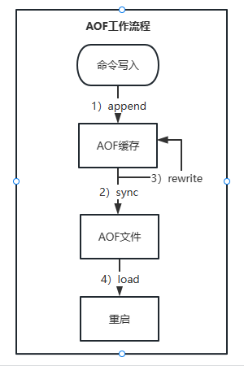
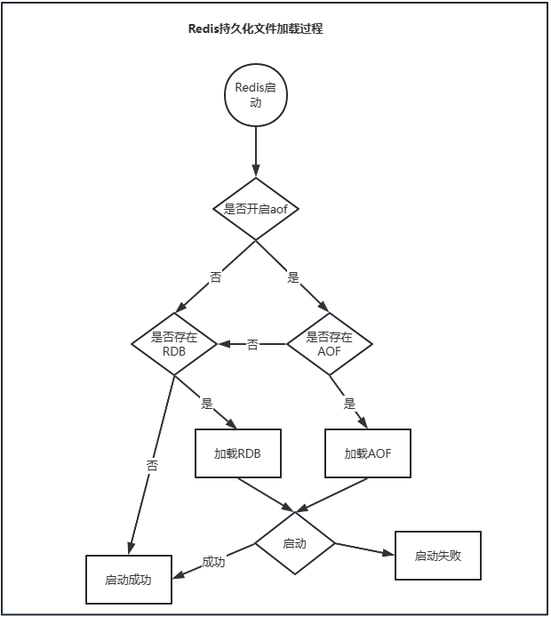
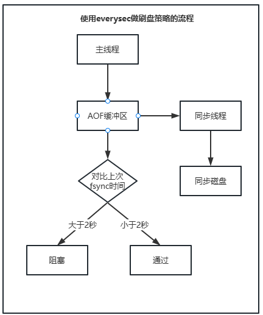

# 持久化

> RDB跟AOF两种持久化机制.

## RDB

> 当前Redis内存中的数据生成快照保存到硬盘。 分为手动触发跟自动触发。
> - 文件路径 dir mypath/xxx
> - 文件名：dbfilename xxx 默认文件名dump.rdb
> - RDB默认采用LZF算法生成RDB文件进行压缩处理，可以通过rdbcompression {yes|no}开启关闭。压缩消耗CPU，但大幅降低文件体积，方便保存或者通过网络发送给其他节点。
> 1. 执行bgsave，父进程判断是否存在正在执行的子进程，存在则直接返回。
> 2. 父进程fork子进程，fork过程redis阻塞。
> 3. fork完成之后，bgsave命令返回"Background saving started"信息，并不在阻塞子进程，可以继续相应其他命令。
> 4. 子进程根据父进程内存生成快照文件，并对原有文件进行原子替换。
> 5. 进程发送信号给父进程表示完成，子进程更新统计信息。  
     

### 手动触发

- save：阻塞当前Redis服务器，直到RDB完成，线上环境不建议使用。
- bgsave：Redis进程fork一个子进程，RDB执行过程由子进程负责，阻塞只发生fork阶段，一半时间短。

### 自动触发

1. 使用save相关配置，如"save m n"。表示m秒内数据集存在n次修改，自动触发bgsave。
2. 从节点执行全量复制操作，主节点自动执行bgsave生成RDB文件发送给从节点。
3. 执行debug reload命令重新加载Redis时，也会自动触发save操作。
4. 默认情况下执行shutdown操作，如果没有开启AOF持久化功能则会自动执行bgsave。

### RDB的优缺点

- 优点：
    1. RDB是一个非常紧凑的二进制文件，代表Redis在某个时间点上的数据快照。非常适合用于备份，全量复制等场景。
    2. Redis加载RDB恢复速度远大于AOF方式。
- 缺点：
    1. 无法做到实时持久化，因为bgsave每次运行都会fork创建子进程，属于重量级操作，频繁操作成本过高。
    2. 使用二进制格式保存，由于Redis版本演进有多个格式的RDB版本，存在版本之间无法兼容的问题。

## AOF

> 以独立日志方式记录每次读写命令，重启时再执行AOF中的命令以达到恢复数据的目的。解决了Redis数据持久化的实时性。
> 开启: appendonly yes  
> 文件名: appendfilename xxx， 默认为appendonly.aof，路径同RDB配置
> 1. 所有命令追加到aof-buf(缓冲区)中；
> 2. AOF缓冲区根据相应策略向硬盘做同步操作。
> 3. 随着AOF文件增大，定期重写，达到压缩目的
> 4. Redis重启时，加载AOF进行数据恢复。
     

### AOF缓冲区同步策略

- always：命令写入aof_buf后调用fsync操作同步到AOF文件，fsync完成后线程返回。
- everysec：命令写入aof_buf后调用write操作，write完成后线程返回。fsync同步文件操作由专门的线程每秒执行一次。
- no：命令写入aof_buf之后调用系统write操作，不对AOF文件做fsync操作，同步硬盘操作由操作系统负责，通常同步周期最长30s。

  > write与fsync操作说明
  > - write会触发延迟写机制，linux内核提供页缓冲区来提高磁盘IO性能。write写入系统缓冲区之后直接返回。同步磁盘操作依赖于系统调度机制。
      > 同步文件之前如果系统宕机，缓冲区的数据将会丢失。
  > - fsync针对单个文件操作(比如AOF文件)，做强制磁盘同步，fsync将阻塞直到写入硬盘完成后返回，保证数据持久化。

### AOF重写机制

> 命令不断写入 --> aof文件变大。Redis重写机制就是为了压缩AOF文件大小。   
> AOF文件重写是把Redis进程内的数据转化为写命令同步到新AOF文件的过程。

1. 进程内超时的命令不再写入。
2. AOF文件只保留最终的数据写入命令，中间发生的一些过程直接省略。
3. 多条命令合并成一条，比如lpush list a, lpush list b, lpush list c ---> lpush list a b c

#### AOF重写触发

- 手动触发： bgrewriteaof
- 自动触发： 根据auto-aof-rewrite-percentage参数确定自动触发时机。
  > **相关配置**
  > - auto-aof-rewrite-min-size: AOF重写时文件最小体积，默认为64M
  > - auto-aof-rewrite-percentage: 当前AOF文件空间大小与上一次重写后AOF文件空间大小比值。
      >
      自动触发时机 = `aof_current_size` > `auto-aof-rewrite-min-size` && (`aof_current_size` - `aof_base_size`) / `aof_base_size` >= `auto-aof-rewrite-percentage`

## Redis持久化加载



1. Redis启动的时候如果开启AOF优先加载AOF文件。`DB load from append only files: xxxx second`
2. 如果AOF不存在则加载RDB文件。`DB load from disk: xxxx second`
3. 加载完成之后Redis启动成功
4. 如果文件存在错误，启动失败

## 持久话问题定位与优化

### 一、fork操作

> fork创建子进程是Redis做RDB与AOF重写是必不可少的操作，对于大多数操作系统来说fork是个重量级错误。    
> fork创建的子进程不需要拷贝父进程的物理内存，但是会复制父进程的空间内存页表。因此fork操作耗时跟进程总内存量息息相关，如果采用虚拟化技术，特别是Xen虚拟机，fork操作会更耗时。

- fork耗时问题定位
  > Redis命令是微秒级的，对于高流量的Redis实例OPS可达5万以上，此时如果fork操作耗时在秒级，将会拖慢几万条命令执行，对于向上应用的延迟将会非常大。  
  > 正常情况下fork耗时应该是每GB消耗20毫秒左右，可以在`info stats`统计中查找latest_fork_usec指标获取最后一次fork操作耗时，单位微妙。

  **改善fork操作的耗时**
    1. 优先使用物理机或者支持高校fork操作的虚拟化技术，避免使用Xen。
    2. 控制Redis实例的最大使用内存，fork操作耗时跟内存量成正比，线上建议每个Redis实例的内存控制在10G以内。
    3. 合理配置Linux内存分配策略，避免物理内存不足导致fork失败。
    4. 降低fork操作的频率，比如适当放宽AOF自动触发几率，避免不必要的全量复制。

### 二、子进程开销监控与优化

> 子进程负责RDB或者AOF文件的重写，运行过程主要设计CPU、内存、以及磁盘三部分的消耗。

1. CPU

- CPU开销分析：子进程负责把数据分批写入文件，这个过程属于CPU密集操作，通常子进程对单核CPU利用率接近90%。
- CPU消耗优化：
    1. Redis属于CPU密集型服务，不要做绑定单核CPU操作。由于子进程非常消耗CPU，会和父进程产生单核资源竞争。
    2. 不要和其他CPU密集型服务部署在一起，造成CPU过度竞争
    3. 如果需要部署多个Redis实例，尽量保证同一时刻只有一个子进程执行重写工作。

2. 内存

- 内存消耗分析：理论上来讲，fork的子进程大小等于父进程大小，所以需用到两倍的内存完成持久化操作。但Linux有写时复制机制，父子内存会共享
  物理内存页，当父进程处理写请求的时候会把要修改的页创建副本，而子进程在fork操作过程中共享整个父进程的内存快照。
- 内存消耗监控：RDB操作以及AOF重写的时候可以通过日志输出来监控子进程消耗的内存量。 
- 内存消耗优化：
  1. 如果部署多个实例，尽量保证同一时刻只有一个子进程在工作。 
  2. 避免在大量写入时做子进程重写操作，这样将导致父进程维护大量的页副本，造成内存消耗。 
3. 磁盘
- 磁盘消耗分析：子进程的主要职责是把AOF以及RDB文件写入磁盘持久化，势必会造成磁盘写入压力。
- 磁盘开销优化：
  1. 不要与其他高磁盘负载的服务部署在一块。如存储服务、消息队列服务等。
  2. AOF重写消耗大量的硬盘IO，可以开启配置no-appendfsync-on-rewrite，默认关闭，表示在AOF期间不做fsync操作。   
  3. 磁盘性能
  4. 单机配置多个Redis实例，可以配置不同实例分盘存储AOF文件，分摊硬盘写入压力。

### 三、AOF追加阻塞
- 阻塞流程分析  
  
  1. 主线程负责写入AOF缓冲区
  2. AOF线程负责每秒执行一次同步磁盘操作，并记录最近一次同步时间。
  3. 主线程负责对比上次AOF时间：
     - 距上次同步时间2秒内 --> 主线程直接返回
     - 距上次同步时间超过2秒 --> 主线程阻塞，直到同步操作完成。  

- 问题：
  1. everysec操作最多可能丢失2秒数据，而不是1秒
  2. 如果系统fsync操作缓慢会导致Redis主线程阻塞。 

- 问题定位
  1. Redis日志输出
     ```log
     Asynchronous AOF fsync is taking too long (disk is busy). Writing the AOF buffer
     without waiting for fsync to complete, this may slow down Redis
     ```
  2. AOF最佳阻塞时`info Persistence`统计中`aof_delayed_fsync`指标累加
  3. 磁盘监控

- 优化：优化方式主要是优化系统磁盘负载，具体方式同上方磁盘优化。

