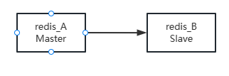
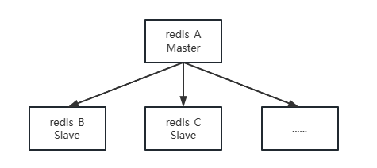
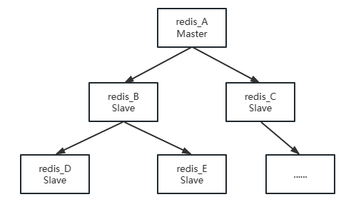
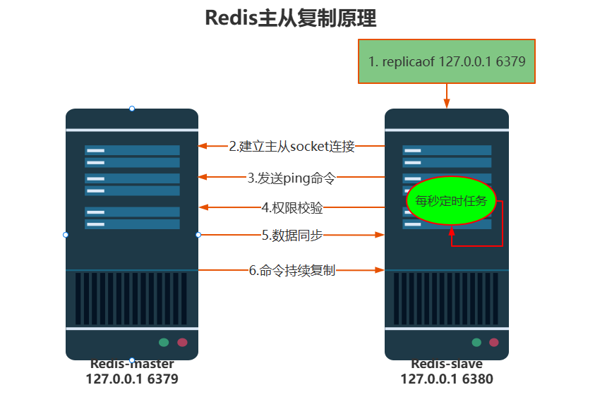
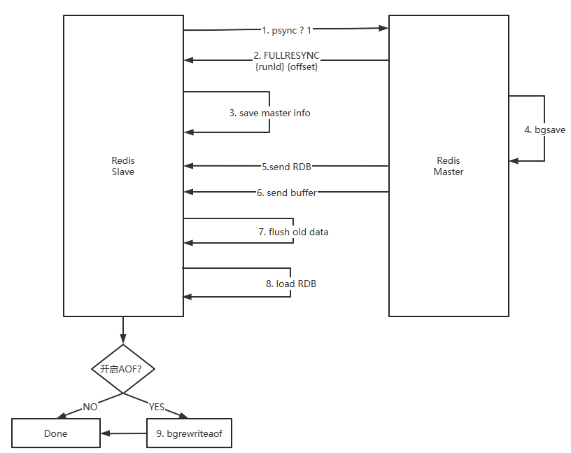
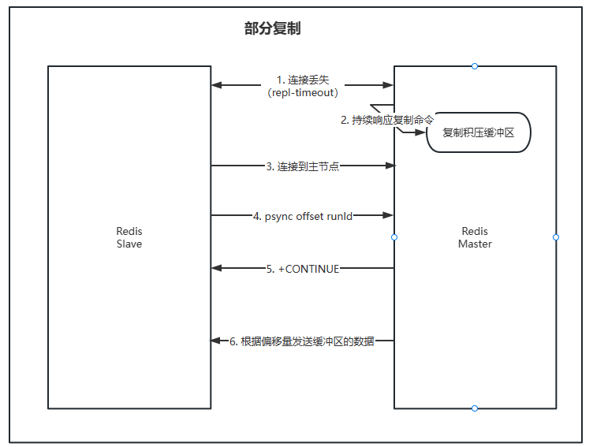
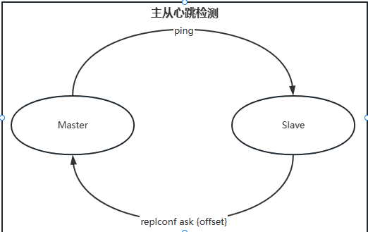
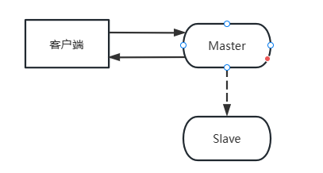

# 复制
> 数据复制多个副本到其他机器，满足故障恢复和负载均衡等需求。复制时高可用的基础。 

## 配置
### 建立复制
- 默认都是主节点，主节点可以同时具有多个从节点。 
- 复制时单向的，只能从主节点到从节点。 

#### 配置方式
1. 修改配置文件，从节点配置文件中加入`replicaof {masterHost} {masterPort}`
2. 启动命令加入 `-replcaof {masterHost} {masterPort}`
3. 客户端中使用命令 `replciaof {masterHost} {masterPort}`

> 配置完成之后主节点所有修改都可以同步到从节点。   
> replicaof命令是异步的，节点只保存主节点信息之后返回，后续复制命令在节点内部异步执行。   
> 通过`info replication`命令查看复制相关状态      
    
```bash
127.0.0.1:6400> info replication
# Replication
role:master                         # 主节点
connected_slaves:2                  # 连接从节点个数
slave0:ip=127.0.0.1,port=6401,state=online,offset=91658,lag=1     # 从节点信息
slave1:ip=127.0.0.1,port=6402,state=online,offset=91658,lag=1     
master_failover_state:no-failover
master_replid:cb813ba385805b0ce3f2df4aa79b301aedd735e5
master_replid2:0000000000000000000000000000000000000000
master_repl_offset:91658
second_repl_offset:-1
repl_backlog_active:1
repl_backlog_size:1048576
repl_backlog_first_byte_offset:1
repl_backlog_histlen:91658
```
### 断开复制  
- slaveof命令不但可以用于建立连接，还可以用来断开连接。断开连接使用命令`slaveof no one`。  
  从节点断开连接之后不会丢失原来复制的数据，只是不能再从原来主节点复制数据。   
  断开复制流程：
  1. 断开与主节点复制关系。  
  2. 从从节点晋升为主节点。   
- slaveof命令还可以实现切主操作。`slaveof {newMasterHost} {newMasterPort}`  
  切主操作流程: 
  1. 断开旧主节点复制关系。  
  2. 与新主节点建立复制关系。 
  3. 删除当前从节点中所有数据。  
  4. 对新主节点进行复制操作。  

### 安全性
1. 主节点通过`requrepass`配置设置命令之后，所有客户端访问都必须使用密码。  
2. 从节点配置`masterauth`，参数为主节点密码，这样从节点才可以正确连接到主节点。    

### 只读   
> 默认情况下，从节点使用`replica-read-only`配置为只读模式，由于主从复制是单向的，
> 从节点所有操作在主节点上无法感知，为了避免主从节点数据不一致，线上环境不建议修改。  


## 拓扑
1. 一主一从结构    
    
   > 最简单的复制拓扑结构，用于主节点宕机时从节点提供故障转移。    
   > 可以只在从节点开启AOF，既保证数据安全性，又可以避免持久化对主节点性能的干扰。
   > 主节点脱机自动重启会导致从节点数据也被清空。如果主节点宕机，可以先通过slaveof no one断开连接之后再重启。    
2. 一主多从结构   
       
   > 利用多个节点实现读写分离。   
   > 主节点写命令多次发送过度消耗网络带宽   
   > 加重主节点负载影响服务稳定性。   
3. 树状主从结构   
   
   > 从节点不但可以复制主节点的内容，还可以当作其他从节点的主节点继续向下复制。   
   > 通过引入复制中间层降低负载以及传送给从节点的数据量。   
   >  

## 原理

1. 保存主节点信息
2. 主从建立socket连接
3. 发送ping命令
4. 权限验证
5. 同步数据集
6. 命令持续复制

### 数据同步
- 全量复制
  
  1. 发送psync进行数据同步，由于第一次复制，从节点中没有保存主节点的id以及偏移量，使用`psync ? -1`
  2. 根据命令解析出当前为全量复制，回复FULLRESYNC相应
  3. 从节点接受并保存主节点的id以及偏移量
  4. 主节点执行`bgsave`命令保存RDB文件到本地。 
  5. 主节点发送RDB文件到从节点，从节点接受并把RDB文件作为本地持久化文件，数据量过大的时候可能会导致失败，可以调整`repl_timeout`增加超时时间。
  6. 从节点接收RDB文件过程中主节点依然接受写入并保存到缓冲区，从节点接收完RDB文件之后主节点发送缓冲区数据给从节点。
  7. 从节点清空自身旧数据
  8. 从节点加载RDB文件
  9. 从节点如果开启了AOF会立即做bgrewriteaof操作，保证全量复制之后AOF持久化文件立即可用。  

- 部分复制
  
  1. 主从节点网络中断超过`repl-timeout`时间，主节点认为节点故障并中断复制连接。 
  2. 连接中断期间主节点依然响应命令， 但因为连接中断无法发送给从节点，保存最近一段时间的写命令数据到复制挤压缓冲区。 
  3. 网络恢复，从节点再次连接主机欸但
  4. 从节点根据自身保存的主节点运行id以及偏移量发送部分复制请求到主节点。 
  5. 主节点接受到请求之后检查runid，并根据offset在复制积压缓冲区中查找，如果偏移量之后的数据在缓冲区，则对从节点发送+CONTINUE相应，表示可以进行部分复制。 
  6. 主节点发送复制挤压缓冲区中的数据，保证主从复制进入正常状态。 
  

- `psync`命令支持
  - 主从节点各自复制偏移量     
    > 主从节点都会保存双方偏移量 `master_repl_offset`以及`slave_repl_offset`, 根据主从节点偏移量比较可以判断主从节点数据是否一致。   
  - 主节点复制积压缓存区
    > 默认1M，主节点有连接的从节点时创建， 这时主节点相应写命令时，不但会发送给从节点，还会写入积压缓冲区。先进先出的定长队列，只能保存最近复制数据吗，用于丢失数据补救。
  - 主节点运行id
    > 识别从节点复制的是哪个主节点。Redis关闭重启之后会发生变化。   
  - psync命令， `psync {runId} {offset}`

### 主从心跳检测
> Redis主从节点建立连接之后，他们之间会一直维持长连接并彼此发送心跳命令。

  

1. 主从节点各自模拟成对方的客户端进行通信，通过client list查看连接状态，主节点连接状态为flags=M，从节点连接状态为flags=S；
2. 主节点默认每隔10s对从节点发送ping命令，判断从节点的存活性和连接状态。repl-ping-slave-period控制发送频率。 
3. 从节点在主线程中每隔1s发送replconf ask {offset}命令向主节点上报当前复制偏移量。relconf命令作用：
   - 实时检测主从节点网络状态。 
   - 上报自身复制偏移量，检测复制数据是否丢失，如果数据丢失，再从主节点复制缓冲区中拉取丢失数据。 
   - 实现保证从节点的数量和延迟性功能。 通过min-slave-to-write和min-slave-max-lag参数配置定义。


### 异步复制 
> 主节点不仅负责读写数据，还负责把写命令同步给从节点。写命令的同步过程是异步完成的。主节点执行完读写命令之后直接返回给客户端，不会等待从节点复制完成。 
  

流程： 
1. 主节点接受写入命令。 
2. 主节点处理命令完成之后返回响应结果。
3. 主节点对于写入命令异步发送给从节点，从节点在主线程中执行命令。   


## 问题 
### 读写分离
对于读操作占比比较高的场景，可以将一部分流量分摊到从节点来减轻主节点的压力。 同时应该注意永远只对主节点进行写操作。     
对于读写分离可能遇到的问题有下面集中。 
1. 复制数据延迟
    > 由于网络延迟，从节点中无法读取到主节点刚写入的数据。需要业务场景允许短时间的数据延迟。    
     对于无法容忍大量延迟场景，可以编写外部监控程序监听主从节点复制偏移量，当延迟过大时发出警报，或者通知客户端避免读取延迟过高的节点。

2. 读到过期数据
    > 当主节点存储大量设置超时的数据时，Redis内部都要维护过期数据删除策略，删除策略主要有两中，惰性删除和定时删除。  
    > 1. 惰性删除：主节点每次处理读取命令时，都会检测键是否超时，如果超时则会执行del命令删除数据。为了保证数据一致性，从节点从来不会主动删除超时数据。 
    > 2. 定时删除：Redis主节点内部任务会循环采样一定数量的键，当发现采样的键过期后执行del命令，之后再同步给从节点。       

   综合上述情况：如果主节点采样速度跟不上键过期速度且主节点没有读取键的操作，那么从节点将无法收到del命令，这是从节点可以读取已过期数据。    
   Redis3.2版本通过从节点读取之间检测是否过期来判断是否返回数据来解决这个问题。升级3.2以上的版本可以解决。  

3. 从节点故障     
   > 对于从节点故障问题，客户端需要维护可用节点列表，当从节点发生故障时立刻切换到其他节点或者主节点上。   


*Redis本身性能比较高，使用过程中应该尽量在主节点上面做充分优化，当主节点优化空间不大时在考虑扩展。*  


### 主从配置不一致   
对于部分配置来说，主从配置可以不一致，最常见的比如说主节点关闭AOF，从节点开启AOF。但是对于一些配置，主从节点需要做到一直， 
比如maxmemory、hash-max-ziplist-entries等参数，当配置的maxmemory从节点小于主节点，在复制的数据量超过从节点的maxmemory时，
它会根据maxmemory-policy策略进行内存溢出控制，此时从节点数据已经丢失，但主从复制流程依然正常进行，复制偏移量页正常。 


### 规避全量复制
全量复制是一个非常消耗资源的操作，下面对需要进行全量复制操作的场景进行逐个分析：
1. 第一次建立复制   
   > 第一次建立复制从节点中没有保存主节点的数据，需要全量复制才能完成数据同步，这种情况下无法避免全量复制，
   > 当对数据量比较大且流量较高的节点添加从节点时，建议在低峰时进行操作，或者尽量避免使用大数据量的Redis节点。  

2. 节点运行ID不匹配
   > 主从复制关系建立后，从节点会保存主节点的运行ID，此时如果主节点因故障重启，那么它的运行ID会发生变化，
   > 从节点发现运行ID发生变化时会认为自己复制的是一个新的主节点，从而进行全量复制。这种情况需要手动将从节点提升
   > 为主节点或者使用自动故障转移的哨兵或者集群方案。 
   
3. 复制积压缓冲区不足
   > 当主从节点网络中断后，从节点再次连接上主节点后或发送`psync {offset} {runId}`到主节点请求部分复制，
   > 如果偏移量不在复制积压缓冲区中，则无法提供给从节点数据，此时部分复制会退化成为全量复制。针对这种情况
   > 这种情况需要通过扩大复制挤压缓冲区，保证`repl_backlog_size > net_break_time * write_size_per_minute`

### 避免复制风暴 
复制风暴是指多个从节点对同一个主节点或者同一台机器上面的多个主节点发起全量复制的过程。复制风暴对主节点或者机器
造成大量开销，导致CPU、内存、带宽消耗。 
1. 单主节点复制风暴
   > 一般发生在单个主节点挂载多个从节点，主节点重启恢复后，从节点会发起全量复制流程，主节点会为从节点创建RDB快照，
   > 快照创建完成之前，如果有多个从节点尝试与主节点全量复制，那么其他从节点将会共享这份RDB快照。同时向多个从节点
   > 发送RDB快照会使得主节点给网络带宽消耗严重，造成主节点延迟过大，极端情况下甚至会导致主节点连接断开。   
   > 解决方案：减少主节点挂载从节点的数量，或者采用树状结构，加入中间层节点来保护主节点。网络开销交给中间的从节点，
   > 不用消耗主节点过多的带宽。但会增加故障转移的难度。   
   
2. 单主机复制风暴
   > 当一台主机上部署多个主节点时，当机器重启恢复后，会有大量从节点针对这台机器的主节点进行全量复制，会造成当前机器网络带宽耗尽。
   > 避免方案: 
   > 1. 避免多个主节点集中在同一个机器上面。 
   > 2. 提供故障转移机制，避免主节点恢复之后进行密集的全量复制。