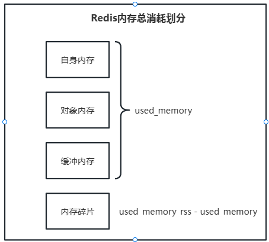

# Redis内存
## 内存消耗在哪里？
### 内存使用统计
```bash
127.0.0.1:6379> info memory
# Memory
used_memory:893392
used_memory_human:872.45K
used_memory_rss:10334208
used_memory_rss_human:9.86M
used_memory_peak:13480240
used_memory_peak_human:12.86M
used_memory_peak_perc:6.63%
used_memory_overhead:835960
used_memory_startup:812272
used_memory_dataset:57432
used_memory_dataset_perc:70.80%
allocator_allocated:956304
allocator_active:1277952
allocator_resident:3559424
total_system_memory:1019351040
total_system_memory_human:972.13M
used_memory_lua:30720
used_memory_lua_human:30.00K
used_memory_scripts:0
used_memory_scripts_human:0B
number_of_cached_scripts:0
maxmemory:0
maxmemory_human:0B
maxmemory_policy:noeviction
allocator_frag_ratio:1.34
allocator_frag_bytes:321648
allocator_rss_ratio:2.79
allocator_rss_bytes:2281472
rss_overhead_ratio:2.90
rss_overhead_bytes:6774784
mem_fragmentation_ratio:12.12
mem_fragmentation_bytes:9481832
mem_not_counted_for_evict:634
mem_replication_backlog:0
mem_clients_slaves:0
mem_clients_normal:20504
mem_aof_buffer:640
mem_allocator:jemalloc-5.1.0
active_defrag_running:0
lazyfree_pending_objects:0
lazyfreed_objects:0
```
`info memory`命令获取内存相关指标   

| 属性名                     | 属性说明                                    |
|-------------------------|-----------------------------------------|
| used_memory             | Redis分配器分配的内存总量，也就是内部存储的所有数据内存总占有量      |
| used_memory_human       | 可读格式返回used_memory                       |
| used_memory_rss         | 从操作系统角度显示Redis进程占有的物理内存总量               | 
| used_memory_peak        | 内存使用的最大值，表示used_memory的峰值               |
| used_memory_peak_human  | 可读格式返回used_memory_peak                  | 
| used_memory_lua         | Lua引擎所消耗的内存大小                           |
| mem_fragmentation_ratio | used_memory_rss / used_memory比值，表示内存碎片率 |
| mem_allocatior          | Redis使用的内存分配器，默认为jemalloc               |

> - 当`mem_fragmentation_ratio`\>1时，说明used_memory_rss - used_memory多出的部分内存并没有用于数据存储，而是被内存碎片消耗，
> 如果两者相差很大，说明碎片率很严重。 
> - 当`mem_fragmentation_ratio`\<1时，这种情况一般是操作系统把redis内存交换到硬盘导致，由于硬盘的速度远远小于内存，Redis性能会很差，
> 甚至僵死。  

### Redis内存消耗划分  

- 自身内存
   > 通常Redis空进程自身内存消耗较少，可以忽略不计。
- 对象内存
   > Redis占用内存最大的一块，存储所有用户数据。Redis所有数据类型都是key-value数据类型，每次创建键值对时至少创建两个类型对象:key对象和value对象。
   > 对象内存消耗可以简单理解为sizeof(key)+sizeof(value)。   
   > Redis每种value对象类型根据使用规模不同，占用内存不同。使用时要合理预估并监控value对象占用情况，避免内存溢出。   
- 缓冲内存
   > 1. 客户端缓冲：所有接入Redis服务器的TCP连接的输入输出缓冲。输入缓冲无法控制，最大空间为1G，如果超出则断开连接。输出缓冲通过参数`client-output-buffer-limit`控制。
   > 2. 复制积压区缓冲：通过`repl-backlog-size`参数设置，对于主节点，复制挤压缓冲区只有一个，因此可以设置比较大的值，避免全量复制。   
   > 3. AOF缓冲区：用于Redis重写期间保存最近写入命令，用户无法控制，内存大小取决于AOF重写时间以及写入的命令量，通常占用很小。  
- 内存碎片
   > Redis默认采用的内存分配器为jemalloc，可选的分配器还有：glibc、tcmalloc。内存分配器为了更好的管理内存，分配策略一般采用固定范围的
   > 内存块进行分配。例如保存5KB对象采用8KB内存，剩下的3KB将不能再分配给其他对象存储。   
   > - 容易出现高内存碎片的场景:  
   >   1. 频繁做跟新操作，例如频繁对已存在的键做append、setrange等更新操作。   
   >   2. 大量过期键删除，键对象过期之后，释放的空间将无法得到充分利用，导致碎片率上升。   
   > - 出现高内存碎片的解决方案:    
   >   1. 数据对齐：条件允许的情况下尽量做数据对其，比如数据尽量采用数字类型或者固定长度字符串等。   
   >   2. 安全重启：重启节点可以做到内存碎片重新整理，因此可以利用高可用框架，将碎片过高的主节点转换为从节点，进行安全重启。   

### 子进程内存消耗
子进程内存消耗主要是AOF/RDB重写时Redis创建的子进程消耗。子进程对外表现与主进程一样，理论上是需要一倍的物理内存来完成重写，
但Linux具有写时复制技术(copy-on-write)，父子进程会共享相同的物理内存页，而父进程处理写请求时会对需要修改的页复制出一份副本完成写操作，
而子进程依然读取fork时整个父进程的内存快照。   
Linux Kernal在2.6.38内核时增加了Transparent Huge Page（THP）机制。虽然开启THP可以降低fork子进程的速度，但之后copy-on-write期间复制
内存页的单位从4KB变为2MB，如果父进程由大量写命令，会加重内存拷贝量，从而造成过度内存消耗。如果高并发场景下开启THP，子进程内存消耗可能是
父进程的数倍，极易造成机器物理内存溢出。   
子内存消耗总结：   
1. Redis产生的子进程并不需要消耗父进程一倍的内存， 实际消耗根据期间写入命令量决定，但是依然要预留出一些内存防止溢出。  
2. 需要设置sysctl vm.overcommit_memory=1允许内核可以分配所有的物理内存，防止Redis内存执行fork时因剩余内存不足失败。
3. 排查当前系统是否支持并开启THP，如果开启建议关闭，防止copy-on-write期间内存过度消耗。  


## 如何管理内存？
### 控制内存上限
使用maxmemory参数限制最大可用内存，目的：
1. 用于缓存场景，当超出内存时使用LRU等删除策略释放内存。
2. 防止所用内存超过服务器的物理内存。  
> maxmemory限制的时Redis实际使用的内存量，也就是used_memory统计项对应的内存。由于内存碎片的存在，实际使用的内存可能会比maxmemory限制的
> 要大，实际使用时要注意这部分的溢出。 例如，一个24G内存的物理及，给系统预留4GB，预留4GB空闲内存用于其他进程或者Redis子进程，剩余16GB可以
> 部署4个max_memory=4的Redis进程。   

- 动态调整maxmemory     
使用过程中可以根据Redis的具体使用情况动态的调整maxmemory的大小
    ```bash
    127.0.0.1:6379> config set maxmemory 500mb
    ```
> 1. Redis默认无限使用服务器内存，为防止极端情况下导致系统内存耗尽，建议所有的Redis进程都要配置maxmemory。
> 2. 在保证系统物理内存可用的情况下，系统中所有Redis实例都可以动态调整maxmemory参数来达到自由伸缩内存的目的。

### 回收策略
Redis的内存回收策略主要体现以下方面：
- 删除到达过期时间的键对象。
- 内存达到maxmemory上限时触发内存溢出控制策略。  

#### 删除过期键对象
Redis所有的键都可以设置过期属性，维护在过期字典中。由于进程中保存大量的键，精准维护每一个键的过期机制会消耗大量的CPU，对于单线程Redis来说
消耗过大，因此采用惰性删除以及定时任务删除机制实现过期键的回收。 
- 惰性删除
   > 客户端读取带有超时属性的键时，如果已经超过键设置的过期时间，会执行删除操作并返回空。节省CPU成本，不需要单独维护TTL链表来处理过期键的删除，
   > 但是单独使用这种策略会由内存泄露的风险。
- 定时任务删除
   > Redis内部维护一个定时任务，默认每秒运行10次。定时任务中删除过期键逻辑采用了自适应算法，根据键的过期比例、使用快慢两种速率模式回收。

#### 内存溢出控制策略
当Redis使用内存大于maxmemory时会触发响应的溢出控制策略，具体策略收maxmemory-policy参数控制，Redis支持一下集中策略：
1. noeviction：默认策略，不会删除任何数据，拒绝所有写入操作并返回客户端错误信息(error)：OOM command not allowed when used memory。此时Redis只响应读操作。 
2. volatile-lru：根据LRU算法删除设置了超时属性的键，直到腾出足够空间为止。如果没有可删除的键，回退到noeviction策略
3. allkeys-lru：根据LRU算法删除键，不管数据有没有设置超时属性，直到腾出足够空间为止。
4. allkeys-random：随即删除所有键，直到腾出足够空间为止 。
5. volatile-random：随机删除过期键
6. volatile-ttl：根据键设置的ttl属性，删除最近要过期的属性，如果没有，回退到noeviction。

> 当Redis一直处于工作内存溢出的状态且设置非noeviction策略时，会频繁触发回收内存操作，影响Redis服务器的性能.

## 如何优化内存？
### redisObject对象
